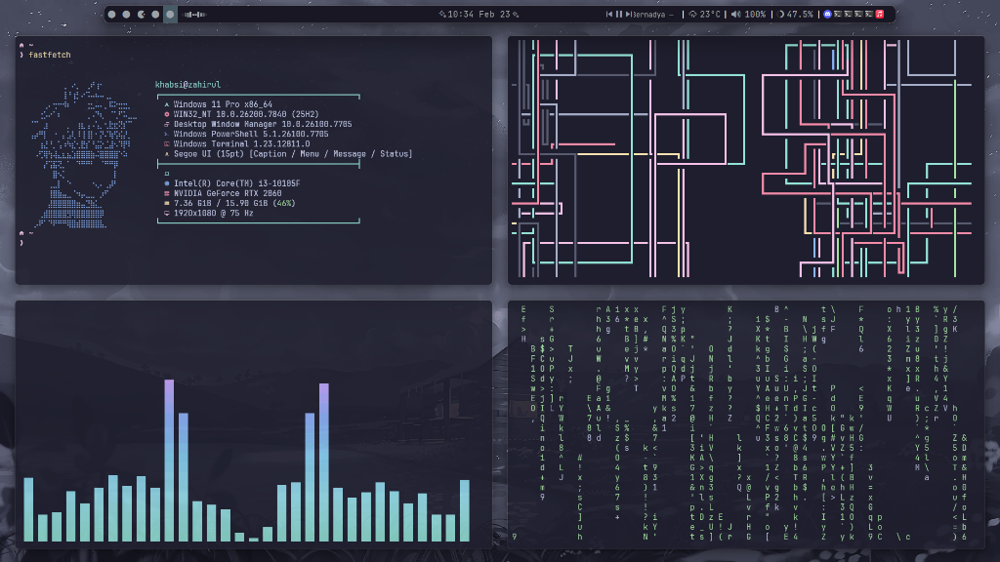
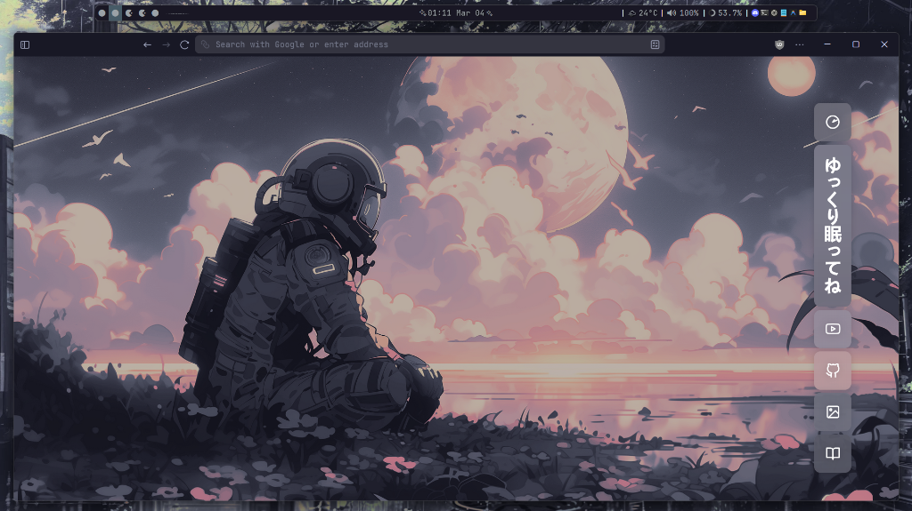

# 🖥️ Dotfiles

My personal dotfiles for Windows 11 setup.

## 🎬 Preview

<video src="https://github.com/Zi-exa/dotfiles/raw/master/ss/rice-preview.mp4" controls autoplay muted loop></video>

## 📸 Screenshot



### 🌙 [Zen Browser Config →](https://github.com/Zi-exa/zen-browser)



## ⚙️ What's Included

| Tool | Description |
|------|-------------|
| **Starship** | Cross-shell prompt customization |
| **Komorebi** | Tiling window manager for Windows |
| **YASB** | Yet Another Status Bar |
| **Fastfetch** | System information tool |
| **WHKD** | Windows hotkey daemon |
| **Winfetch** | Windows system info script |
| **CAVA** | Console-based audio visualizer |

## 🛠️ System Info

- **OS**: Windows 11 Pro x86_64
- **CPU**: Intel Core i3-10105F
- **GPU**: NVIDIA GeForce RTX 2060
- **Resolution**: 1920x1080 @ 75Hz
- **Terminal**: Windows Terminal
- **Shell**: PowerShell

## 📂 Structure

```
.config/
├── cava/          # Audio visualizer config
├── fastfetch/     # System info tool config
├── komorebi/      # Tiling WM config
├── spotify-tui/   # Spotify TUI config
├── starship/      # Starship prompt config
├── winfetch/      # Winfetch config
├── yasb/          # Status bar config
├── ss/            # Screenshots
├── komorebi.json  # Komorebi main config
├── starship.toml  # Starship main config
└── whkdrc         # Hotkey daemon config
```
